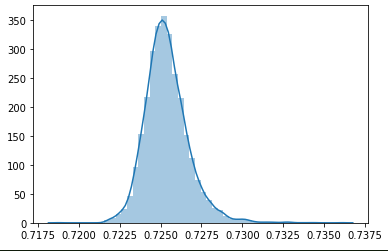

 
Memnet[^1] was an attempt to build a neural network-based model to predict the memorability of an image. This attempt was carried out by Khosla et al. at the Computer Science and Artificial Intelligence Labs at MIT to moderate success. It is the most commonly used neural network regression for this purpose, and has been used and cited in many research papers since publication. There are some problems, however. Memnet was built in Caffe, a deep learning framework which has been defunct since shortly after Memnet's publication. Memnet was trained on LaMem, a dataset to which public access has been restricted. For the past couple of months I, under the auspices of the Brain Bridge Lab at the University of Chicago, have been investigating the model itself, as well as making some tweaks to utilize newer techniques and hardware access to solve the same problem.

## The Old Model

First things first, load up the Caffe model. This is easier said than done. For one, Caffe was designed for 32 bit systems, and the rest of the computing community has pushed forward, dropping 32-bit support. I don't need to get into exactly what was necessary to get caffe to run on a modern system here, but in short, be prepared to cut features out in the makefile.

For the reader who is more familiar with machine learning than psychology, the numbers reported in this discussion might seem strange. Although Memorability *is* a number between 0 and 1, it is still ultimately a relative value. Because of this, most papers about predicting memorability scores do not report Euclidean loss, but instead, report Spearman Rank Correlation. This is done by ranking each value in two lists, and then measuring the Pearson or Standard Correlation between the ranks.

Testing the version of MemNet available on the LaMem website website yields a Spearman rank correlation of about 0.565 on the provided test split, which is within expected limits of the 0.57 reported in the paper, with variation probably due to hardware reasons, or due to the fact that I had to jury rig a 64-bit version of Caffe. There is, however, some weirdness with these outputs.

When you plot the whole distribution of memorability scores for each image in LaMem, you get a certain distribution curve. Now, if you plot the distribution of scores predicted by a model, you *should* get a similar curve. An optimal model, which gets every score correct within some margin, should have almost the same curve. Now, passing this simple sanity check isn't proof that your model is correct, as you could conceivably have the same distribution, but have all the scores be mismatched, failing the test *is* sufficient to say that the model needs work. One interesting thing, which is rather related to the earlier discussion of Spearman Rank Correlation is that if the model is regressing toward the mean, that is, it's achieving the best loss by just predicting the mean every time but with some small variation, if that variation is correlated with the ground truth, you can have a very good rank correlation, but a rather lousy loss. Running this analysis on the CSAIL MemNet implementation which is available on the website, yields results like this.

This shows the distribution of the predictions on LaMem, note that the mean is ~ 0.725, and the distribution is very tight. The standard deviation is on the order of 0.0025.

This shows the distribution of the LaMem ground truths. Again, see that the mean is around 0.725, but the standard deviation is on the order of 0.15.

 
This further implies that MemNet is probably not as generalizable as previously thought, or at least as it has been implemented in most cases. When paired with a ten-crop pre-processing, MemNet performs much better on this test, but it does still have some disparity. Instead of having a standard deviation of about 0.0025, it has a standard deviation of about 0.08, which is much more tolerable, but still significantly less varied than the ground truth.

## The New Old Model

Let's take a swing at modernizing MemNet. Running a Caffe Model downloaded from the Internet is largely plug-and-play. We don't need any knowledge of the model's architecture or anything to get it to work, it's just a function that takes in a photo and outputs a number. To rebuild the thing in PyTorch, however, we may need to put some thought in.

A skeleton diagram of the layer-structure of MemNet. It's designed to mimic the hugely successful image classifier AlexNet, which consisted of a few convolutional layers followed by 3 fully connected layers. In reality, the convolutional features of MemNet differ slightly from that of AlexNet. 

 

We need to reconstruct this from what can be gleaned from the `.caffemodel` that is provided on CSAIL's website. For brevity, I won't write up the code here, but I will post it in an [appendix](https://www.coeneedell.com/appendix/memnet_extras/#memnet). We will also need to conduct our hyperparameter tuning. Using Weights and Biases, we get results like this:

For most of these runs, we have created a random split on LaMem, and tested our new MemNet implementation using both a train set and validation set drawn from LaMem. The cyan line, labeled `trainOnLaMem-valOnMemCat` is the result of training the model on LaMem, and then testing it on a different dataset called MemCat[^3]. This is very low compared to the within-LaMem results. The salmon line is the opposite, a model that was trained on MemCat and tested on LaMem. This is astounding because not only does LaMem purport to be a generalizable dataset, it is also around 55-thousand images whereas MemCat is made up of only ten-thousand. This implies that LaMem alone may not be as general as once thought. There are probably some features that are very common among LaMem data which are not apparent in MemCat. This is something to keep in mind going forward. Another thing to note is that the best performing model on LaMem alone peaks at around 0.56 rank correlate with the data. This is within the expected limits of Khosla et al.'s reported 0.57.

Now let's do some tweaking.

## ResMem

Historically, the next big advancement in using neural networks for computer vision was ResNet. This allowed for convolutional neural networks to be built deeper, with more layers, without the gradient exploding or vanishing. Knowing that, let's try to include this in our model. What we will do is take a pre-trained ResNet, that is the whole thing, not just the convolutional features, and add it as an input feature for our regression step. The code for this is [here.](https://www.coeneedell.com/appendix/memnet_extras/#resmem)

For the following discussion, while ResMem is initialized to a pre-trained optimum, I have allowed it to retrain for our problem. The thought is that given a larger set of parameters the final model *should* be more generalizable. Using weights and biases, we can run a hyperparameter sweep.

Here we can see much much higher peaks, reaching into the range of 0.66-0.67! All of these runs were both trained and validated on a dataset that was constructed from both MemCat and LaMem databases.

## TripleMem

Going forward, I'm going to try to add a third feature to our model. This one is based on Semantic Segmentation. There is, however, a problem. Semantic Segmentation outputs a data array that is much more high-dimensional than an image, so it cannot be squished directly into a standard linear layer. The way this will be implemented is as a pre-trained segmentation model, which will not be retrained during the process, and a small convolutional neural network to process the segmentation into more simple convolutional features.

While this model has not undergone full testing yet, the preliminary results are promising. It is, however, much heavier than ResMem, taking almost four times as long to train on my GTX 1080 TI.

[^1]: https://people.csail.mit.edu/khosla/papers/iccv2015_khosla.pdf
[^2]: http://memorability.csail.mit.edu/explore.html
[^3]: http://gestaltrevision.be/projects/memcat/
