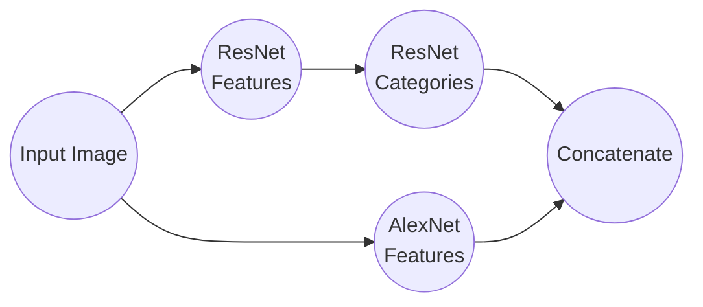

In my last [post on computer vision and memorability](), I looked at an already existing model and started experimenting with variations on that architecture. The most successful attempts were those that use Residual Neural Networks. These are a type of deep neural network that is built to mimic specific visual structures in the brain. ResMem, one of the new models, uses a variation on ResNet in its architecture to leverage that visual identification power towards memorability estimation. M3M, another new model, extends this even further by also including semantic segmentation data generated by another Residual Neural Network based method, but more on that later.

