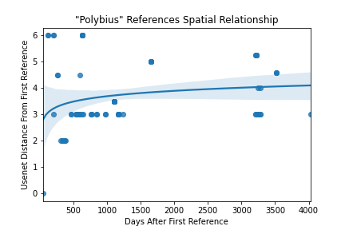

<h2 id="introduction">Introduction</h2>

Urban Legends, or Contemporary Legends, are a type of folklore popularized by Jan Harold Brunvand in his book: <em>The Vanishing Hitchhiker: American Urban Legends &amp; Their Meanings</em>. Urban Legends are considered to be the modern continuation of the human tradition of folklore and legends. Folklore does not occur exclusively in so-called primitive or traditional societies, and by studying modern folklore in the same way that we study the folklore of traditional societies, we can also learn about modern societies(Brunvand 2003). Urban Legends, like their past counterparts, form as complete stories with plot and characters, although the exact identities of these characters tend to stay vague, unlike mythic stories.

We have to focus our attention though and draw boundaries between legend, fake news, conspiracy theory, conjecture, and so on. We are all fully aware that the systems that make the Internet a breeding ground for urban legend, also make it a fantastic substrate for the other types of rumor and hearsay (Blank and McNeille 2018). For our purposes, we will consider the genre of “Urban Legend” to be defined by the fact that the people who spread the legend know that it isn’t true. Conspiracy theories tend to be spread by the true believers, and fake news tends not to be spread by people, but by robots and organizations. In addition, the Urban Legend tends to take place in a fuzzy time-frame, the near past. Generally, the Legend happened in a less-specific time, the storyteller will not give a date, nor even a month in which the story occurred. Only in the most specific of legends will the story include, at most, a season in which the story occurred, but rarely a specific year. Some examples include the story of the arcade cabinet, Polybius, that supposedly appeared in a Portland area bar in the summer of 1983. The story goes that the cabinet was responsible for children and teens forming a line out the door, until it eventually hospitalized a kid who had played it for too long. Many legends will give you a decade, or an era. The story of the Foo Fighters, mysterious lights in the sky, took place during World War II, fueling speculation and conspiracy theories about the secret technology of the Third Reich. There are real government documents that report sightings of Foo Fighters during the late 1930s and early 1940s, but many of the stories that circulate are apocryphal. Generally, the reports talk about seeing strange glimmers in the distance, whereas the stories you might hear on the internet talk about seeing faces emerging from lights, clouds parting, the weather suddenly changing, and pilots engaging in dogfights with ghostly adversaries.

These stories that are anchored in a time and place become unstuck in time when they’re reproduced and refactored into urban legends, but most of the legends are timeless. Generally the story will take place in the near past, some time in the past two years from the time of storytelling. For example, the story of the Vanishing Hitchhiker could have occurred in any time or place, hitchiking has been a common occurrance in any society that has access to roads and wheeled vehicles. In it’s modern form, the legend has been traced back to the 1870s and similar stories can be found in societies around the world(Brunvand 2003). In general, the legend portrays a hero and a stranger. The hero picks up the stranger by the side of the road, and gives them a ride. The stranger is either silent, or makes odd conversation. Then, when the hero finally starts to become agitated by the stranger’s behavior, the stranger vanishes from the moving vehicle. The vague nature of the urban legend also extends to its characters. In the story of the Vanishing Hitchhiker, the characters could be anyone. Another example is the story of the Black-Eyed Children. According to the story, a child with solid black eyes appears at the door of the hero. The child asks the hero if they can use the bathroom. When asked about their background, the child dodges the question. The child speaks in a monotone, and has perfectly white teeth, the stories always mention the whiteness of the teeth. They speak with the diction of adults. The child continues to insist that the hero invites them in, until eventually the hero breaks down and flees, in some cases they might even call the police, only to find that there is no trace of the child as soon as they check their entryway again.

Because the characters can truly be anyone, the the stories plausibility is never tied to the identity of the character, and more importantly, the story can be spread by anyone. The storyteller generally doesn’t go so far as to say that they are the hero, but it’s often someone they know, but not a core friend or immediate family. This is so common that modern urban legends are sometimes called FOAF or friend-of-a-friend stories. By disconnecting the story from the storyteller, it’s possible for anyone to tell the story, and still have the tension be heightened by an intrinsic familiarity with the storyteller.

Often it can be hard to tell the difference between a conspiracy theory and an urban legend. Conspiracy theories either exist in a sharp time frame, like the Kennedy Assassination, or they exist in the present and are presented as ongoing. This is a major delimiter. The conspiracy theory can take place over a variable length of time, for example stories about the Illuminati claim the organization date to anywhere from the 1800s to ancient times. The Urban Legend, however, always ends when the story ends. The hero does not adopt a black-eyed child, the driver does not get a drink with the vanishing hitchhiker every Friday going forward. Fake News on the other hand always exists in the Now, and often includes a Call-To-Action which forces it to be mixed up in current events. Fake News usually falls into the wider category of Hoaxes, being stories that are written and disseminated with the express purpose of deceiving the public. In addition, the star characters in Fake News and Conspiracy Theory are celebrities, senators, presidents (Frank 2011). Most conspiracy theories also place the conspiracy at the foot of a specific person or group, for example the military, a president, or Woody Harrellson’s father. By contrast, the identity of a character in an urban legend is always an individual, but their exact identity is vague. Urban Legend stars the everyman, the friend of a friend, the weird uncle, but it also stars some hard-to-understand entity, like a fairy, an alien, slenderman, or a large company’s incomprehensible legal policies.

Another delimiter between Urban Legends and other forms of modern lore is the argumentative role of the story. The story in an urban legend fits into the same sociological niche as the folklore of old. The story is often a morality play, often teaching the audience caution. The hero often survives to tell the tale precisely because they were suspicious of the circumstances as soon as they appeared.

Some previous work on urban legends has defined them as being related to rumors (Dunn and Allen 2005). This stance usually maintains that both rumors and legends are told with the intention of being believed, told as if they are true, and are difficult to verify. The distinction between the two being that rumors are generally smaller, simpler stories, and are not told in a narrative fashion. Consider a rumor like “I heard that John in HR is secretly dating Cassie in accounting” or even something with larger stakes like “Justin Trudeau is having an affair with Angela Merkel”. These stories don’t contain a narrative arc in the same way that the quintessential urban legends do.

Generally “Urban” or “Contemporary Legends” describes stories that few people truly believe, but are still told and retold time and time again. These stories often have common features, they leverage the unintuitiveness of modern life, a sense of distant credibility (“This happened to a friend of a friend”), and in some cases a sociopolitical call-to-action. Prototypical Urban Legends include the story about a man meeting a woman in a hotel bar and waking up the next day missing a kidney in a bathtub full of ice, or the story where your uncle’s friend went down into the sewers and encountered a bask of exotic crocodiles that had been flushed down by irresponsible pet owners.

But let’s focus for a moment on that third millennium (and also the decade leading up to it). The human experiment (although mostly the western countries and Japan), had just been linked to one another through the Internet. Before Google created the “clearnet”, before Facebook acquired every social forum, we had specified forums, on separate sites, operated by separate people. We had Usenet, a social media system built out of email and simple text-based servers.

Usenet was a system of email mailing lists that were connected and chained together in a manner such that anyone could post on them, and anyone could read the history. They functioned somewhere between bulletin board systems and email newsletters, and filled the niche that would later be overrun by forum software. The main difference being that usenet was decentralized. Usenet hosts would pass messages along to people, and receive messages from posters, often through a chain system, to ensure that a post which was sent to more than one newsgroup got to all of the requested recipients (“RFC1036: Standard for Interchange of Usenet Messages” 1987).

Usenet was divided into newsgroups, which were in turn divided into subgroups. Generally these would be addressed by their hierarchy, separated by a period. For example, <code>sci.agriculture.beekeeping</code> would be a board about beekeeping, but it also fit under the subcategory agriculture, which was in the science hierarchy. There were a number of hierarchies which were controlled by specific groups. The major groups are referred to as the Big 8. Originally, in 1980 when Usenet was created there was only one major newsgroup, which was called <code>net.*</code>. In 1987, Usenet went through a major restructuring, creating the Big 7. These were intended to be an encompassing set of categories, and they were: <code>comp.*</code>, for discussion of computer related topics, <code>news.*</code>, for discussion of Usenet itself, <code>rec*</code>, designed for recreational activities like games and hobbies, <code>sci*</code>, discussing science, <code>soc.*</code>, for both socializing and for discussing social issues, <code>talk.*</code> which was targeted at discussion of contentious issues like religion and politics, and finally <code>misc.*</code>, things that don’t fit in the other Big 7. This restructuring led to a controversy about what was allowed on usenet. Even <code>misc.*</code> was heavily moderated. The rules for each hierarchy were set up as to prohibit, from any of the big 7, discussions about recreational drug use, sex, or sharing recipes. So the self-styled Usenet Cabal set up an eighth major newsgroup, <code>alt.*</code>. Designed to keep the debauchery of the internet contained. <code>alt.*</code> is not considered an official member of the Big 8, and the real eighth member was added in the 90s, <code>humanities.*</code> for discussion of the humanities, in a similar spirit to <code>sci.*</code>. The <code>alt.*</code> newsgroup however, became a free-flowing, unmoderated message board, with all of the issues that includes. The Usenet community would often jokingly refer to <code>alt.*</code> users as “Anarchists, Lunatics, and Terrorists.”

In a time before Google, or even Snopes, you couldn’t fact check that troll’s rant, and those rants spread like wildfire(Dunn and Allen 2005) (Donovan 2004). Even in the later times of transition, we saw legends like the story of slenderman, video game related legends like “Herobrine”, and so on. Obviously we see the scarier legends show up on forums dedicated to horror stories and urban legends, we see video game legends sprout up out of those games’ communities, and we see less intense legends appear in more general use communities(Blank 2007). These are things like the story about the Neiman Marcus cookie recipe. This brings us to the question: How do Urban Legends spread through online communities, and how do those communities effect the nature of the legend itself?

<h2 id="methods">Methods</h2>
<h3 id="data-sources">Data Sources</h3>

Much of the early internet is made available to us. Groups like the Internet Archive host repositories full of early internet interactions. Many of the forums that people used to discuss broad topics are still existing, and keep their old posts up for posterity. That being said, this is far from complete, IRC (Internet Relay Chat) logs will be mostly wiped from the record. IRC servers were often private, and hosted by private entities. In addition, the Usenet archive that will be used for this discussion is not complete, it is however very comprehensive for the boards that it exists for, and this includes the largest boards. By compiling usenet records, we see a very large section of the picture. We will be able to see links between individuals, and links between communities (archive.org 2020). I will focus on a couple of usenet newsgroups, <code>talk.*</code>, <code>soc.*</code>, <code>rec.*</code>, and <code>sci.*</code>. I have also procured data from select <code>alt.*</code> newsgroups, including <code>alt.folklore.*</code>.

Using text classification methods, we can sift through these posts, and pick out a selection of urban legends that we will use to study their dynamics overall. Then, we can find posts that reference those legends. Conceptually, we can imagine that posts fit into one of three categories, irrelevant, which consists of posts that do not reference the urban legend at all, carrier, which consists of posts that reference the story in passing, but don’t tell the story, and spreader, which consists of posts that tell the legend, thus spreading it to other people in the community. We can imagine that a single user can write posts that belong to all of these categories, but each individual post can only belong to one.

The spreader posts will be generally longer, and will likely not differ much from one another, the carrier posts, however, will rarely be similar. By way of explaining this, consider the case of the Foo Fighters. Since they only reference the phenomenon, only a small portion of their verbiage is devoted to the story. As such, you can imagine a carrier post that references Foo Fighters but is really all about the nature of paranoia in conflict, and you can imagine another carrier post that uses Foo Fighters as way to springboard into a discussion about the government hiding secret technology from the public. Both of these posts reference the story, and both of them do the same job, serving as a vector of initial exposure to the story, but text classification systems and topic modeling would not associate them unsupervised. Compare this to two spreader posts. Since they both serve to tell the story, the bodies of the post would have to be mostly devoted to telling the story. Even if one was leveraged at telling the story of the Foo Fighters to aviation experts, and therefore might employ aviation jargon to make the story more believable, and another was leveraged toward a more general audience, the bulk of the story is the same. Because of this, a text classification system or topic modeling would label these two posts as more similar.

<h3 id="data-modeling">Data Modeling</h3>

Since these data sources size in the hundreds of gigabytes of unstructured text data, they need to be organized in such a way to make analysis easier both on the scientist and on the computer. In their raw formats, usenet posts are stored in a mailbox file. Posts are delimited by a line that reads <code>FROM</code> and then a long string of numbers. They then have a block of metadata, followed by the body. Usenet allows many optional metadata fields, but requires a few.

The data model reads through a mailbox file, and extracts the only the required fields of metadata, storing it as attributes of the <code>Post</code> object. The <code>Post</code>s are sorted together into <code>Newsgroups</code> which are sets that are inherently tied to a zip file on the computer. They have special methods to save and update the <code>Newsgroup</code> from disk. They can be constructed either by providing a list of posts to add to the <code>Newsgroup</code> and a file name for the zip file, or using an alternate constructor. One of these can construct a <code>Newsgroup</code> by specifying a <code>.mbox.zip</code> file as provided by archive.org. This will take a while. Another can do this by specifying a newsgroup as specified by the Usenet protocol. This will take longer.

The <code>Newsgroup</code> acts like a normal set, but it also has methods to save the current state of the set to the zip file, and to load a zip file constructed by a <code>Newsgroup</code>, adding those <code>Posts</code> to it.

<code>Posts</code> have a unique identifier, which is delimited by the Message-ID: metadata tag. Since these are unique for all of Usenet, they can be used to tell if two posts are identical across newsgroups. The <code>Newsgroup</code> class is implemented such that it will detect this and not repeat two <code>Posts</code> with the same message ID. <code>Newsgroups</code> can then be iterated over like any other set, and extracting information from them is reduced to an 𝒪(1) operation.

For more information see the <code>analysis.py</code> file stored at <a href="https://github.com/UC-MACSS/final-research-paper-SoyBison">https://github.com/UC-MACSS/final-research-paper-SoyBison</a>.

<h3 id="analysis">Analysis</h3>

Using those three categories above, we would construct a temporal model of spread through the network that will let us understand how the legend spreads overall. This is a contagion model of ideas that is based off of the idea that the individuals in the community are exposed to a legend, and then spread it for some amount of time, before they get bored of it and stop. In addition, we can use topic modeling to create a set of features for all of the spreader posts for all of the urban legends that we’re studying, and see how the spreader posts change their telling of the story based on the community that they’re talking to. For example, we’d expect the story of slenderman to take on a different tone in an anthropology focused community than it would in a parenting focused community.

The contagion model posits that each individual in the community is either <em>infected</em>, <em>susceptible</em>, or <em>recovered/dead</em>. These are sometimes called SIRD models. Since an Urban Legend (mostly) cannot kill, this model will not consider anyone to be dead.

Ideally the topics that we deconstruct from the spreader post serve as analogues for the “genes” in the Darwinian model of idea spread (Dawkins 1989) (Kronfeldner 2014). Under this theory, we would expect that the topics in a spreader post will change as the legend interacts with a new substrate, a specific type of community. Previous work on the Darwinian model of ideas focused on the concept of emotional selection. Ideas that employ emotional techniques, pathos argumentation, or evocative imagery tend to spread faster than those that don’t.

For this analysis, I will examine a small subset of urban legends. One that is more general, and originated well before the dawn of the internet, and then a set of three urban legends that are specific to a particular community, the community surrounding early video games. By comparing the dynamics of these stories, we should be able to determine some relationship between the content of a story and the community that it takes hold in.

The first story is the story of the Foo Fighters, which I have mentioned already. The other three legends were chosen for their high level of representation on usenet, the level to which members of the video gaming community would be familiar with them, and some special traits that should theoretically affect their dynamics.

The first story is often referred to as “Sheng Long”. So the story goes, in the arcade game Street Fighter II(1991), there was a secret playable character named “Sheng Long”. This came from a mistranslation of the character Ryu’s special move, which, in Japanese is “Shōryūken”. The line in Japanese translates to “You must defeat the Shōryūken to stand a chance. Shōryūken is written as”昇龍拳" in Japanese, and the first two characters are written in Chinese Pinyin as “shēng lóng”. This roughly translates to “rising dragon” (Shiozawa 2008). However, in the early ’90s, no forms of Chinese were particularly common in the United States, so this led many Americans to believe that that Sheng Long was a secret character. The legend was cemented when the video game magazine Electronic Gaming Monthly released an April Fools edition that “confirmed” the existence of Sheng Long as a secret playable character (Davis 1992). Nods to this legend were later incorporated into the game series by the designers, although no playable Sheng Long has been included in any Street Fighter game.

The second legend is of a possible cheat code for Tomb Raider (1996). According to the legend, the cheat code changed the main character, Lara Croft’s character model to one that isn’t wearing any clothes, especially exposing the character’s uncensored breasts. This legend belongs a class of urban legends surrounding video games, often called the “adolescent fantasy code”. Practically every major video game franchise has at least one of these legends floating around. Generally, the case of Lara Croft is referred to as “Nude Raider”. As an urban legend, this one is an interesting case, as it was, at least partially, true. A third party modder had uploaded an unofficial patch that did replace the character model with a nude one. However, the legend states that this model was part of the original game, and the mod only turns the clothes off. The spreading of the legend wasn’t helped by the fact that the modder leaned into the claim that they didn’t create the nude raider, they only found it in the pre-existing game code (BBC-Sci/Tech 1999).

The third legend is that of Polybius. An arcade cabinet that supposedly would control the player’s mind. The story is long, and has mutated over the years, but the gist is that in an arcade in Portland, OR, in the 1980’s, two men in black bring in an experimental arcade cabinet, Polybius. The game was supposedly so good that the arcade had a line out the door for weeks. But then, the people who came to play the game started suffering from strange disorders, seizures, insomnia, addiction-related symptoms. Finally, a death is attributed to the game, and the men in black return to take it away, just as silently as it arrived(“Polybius (1981)” 1998). The story survived as an urban legend for a long time, and although it’s not entirely confirmed where it came from, a recent documentary has posited that the story was a hoax created to draw attention to the arcade cabinet database https://www.coinop.org (Brown 2017). The main evidence for this is that the coin-op entry seems to predate any forum or usenet posts anywhere on the internet.

Each of these legends presents their own unique traits and difficulties. The legend of Sheng Long is unique in that the fires were stoked by a mostly reputable games magazine at the time, and was later embraced by the developers themselves. Because of this, we can imagine that users might not be inhibited a lack of confidence in the legend’s voracity. The legend of the nude raider is unique in that it has a salacious element. Because of this, we can imagine that the legend is carried by its titillating nature across the internet, thus spreading faster. The legend of Polybius, has the interesting trait that it’s primarily famous within the arcade gaming community, only breaching to the mainstream gaming community recently. This is a phenomenon that needs to be explained.

There are some operational difficulties with these legends as well, the legend of the foo fighters, for instance, could confuse computational methods with the grunge band named after the legend. Sheng Long presents a challenge in that it’s sometimes referenced on usenet in relation to the use of the phrase in Chinese. Research on the legend of Polybius is hindered by the existence of an ancient historian of the same name. Research on the Nude Raider has sometimes turned up posts referencing literal pornography. I intend to get around these problems by analyzing the body text of many posts and incorporating keywords into the filtering method to ensure that the main dataset has, at the very least, a minority of these non-sequitur cases.

To facilitate quantitative analysis of usenet, I have developed a distance metric for usenet newsgroups. Then, we can measure the distance between two posts as the mean of the pairwise distances between all of the newsgroups that the posts were posted to. Each newsgroup is made up of a sequence of strings like:  <em>N</em> = <em>x</em><em>n</em>  Where each level in the hierarchy is given by <em>n</em>. We can think of the hierarchy of newsgroups as similar to the taxonomic tree in biology. However, there is an implied node of this hierarchy, <code>"usenet"</code>. For our purposes we’ll signify it as the null newsgroup, ∅.

<figure>
<figcaption>Figure 1: The Structure of a selection of usenet newsgroups, shown as a tree.</figcaption>
</figure>

We define the distance between two newsgroups as the number of steps along this tree (shown in Figure 1) that you need to take to get from one to another. For example, the distance from <code>rec.games</code> to <code>soc.culture.india</code> is 5. The distance from <code>rec.games</code> to <code>rec.aviation</code> is 2. The distance from <code>soc.culture.usa</code> to <code>soc.culture</code> is 1. This satisfies the identity of indiscernibles, the symmetrical property, and the triangle inequality.

<h2 id="results">Results</h2>
<figure>
<figcaption> Figure 2: Posts from <code>rec.aviation.*</code> organized by date posted, and shown with corresponding cross-post newsgroups.</figcaption>
</figure>

First, I looked at occurrences of the story of the Foo Fighters. For this case, I looked only at posts that were sent to <code>rec.aviation.*</code> newsgroups. Since a single post can also be cross-posted to other communities, we can see where else these posts ended up, and how that location changed over time. First, I’d like to point out that there are two clear clusters in time that the foo fighters story is mentioned outside of military and piloting communities. They are mostly cross-posted to other newsgroups about the military, or to groups that are about aliens, conspiracy, and the paranatural.

We see a sort of trumpet-shape, with posts referencing foo fighters starting out as being only posted to aviation themed newsgroups. Later though, these posts are being cross-posted to message boards about the paranatural. In addition we see that clusters of foo fighters related posts within the military community surge and then trail off in time.

There are also small clusters of posts during the earlier surge in the <code>rec.aviation.student</code> and <code>rec.aviation.piloting</code> communities. These are communities that are focused on piloting techniques and new pilots. Unlike in the military community, we see a slower pickup, but a faster trail off in infections.

In the gaming related cases, we apply the usenet distance metric and see that the average distance from the first recorded post follows a roughly log-linear pattern. We can also see that the density of posts decreases over time and distance, as the legend diffuses. This supports our hypothesis that the spread of urban legends slows down with contact with unrelated communities. All three of these examples diffuse much slower, and have a much flimsier foothold on communities outside of the <code>rec.games</code> hierarchy. For some clarification, the first mention of the Sheng Long legend is in <code>rec.games.video.arcade</code>. The first mention of the Polybius legend is in <code>rec.games.video.arcade.collecting</code>. The first couple mentions of the “Nude Raider” are in <code>rec.games.computer.*</code>. Because some of these hierarchies are so deep, it’s hard to see from distance alone when the rumor leaves the <code>rec.games.*</code> hierarchy, but generally posts that have a distance greater than 5 are outside the <code>rec.games.*</code> hierarchy.

<figure>
<figcaption>Figure 3: Posts that reference the “Nude Raider” Legend. Day 0 is April 13, 1997.</figcaption>
</figure>

Figure 3 shows the relationship of usenet posts that reference the “Nude Raider”. Since the story has a universal appeal due to its salacious nature, as we expect, the prevalence of the legend does not dissipate as it spreads across usenet.

<figure>
<figcaption>Figure 4: Posts that reference the legend of Sheng Long. Day 0 is July 9, 1991.</figcaption>
</figure>

Figure 4 shows the relationship of usenet posts that reference the legend of Sheng Long. The plot shows that while the legend has legitimate staying power in <code>rec.games.video.arcade</code>, its influence dissipates quickly outside of the relevant sphere. Because this legend is about the game itself, we wouldn’t expect for it to get a major foothold in other gaming communities, and especially not in non-gaming related communities.

<figure>
<figcaption>Figure 5: Posts that reference the legend of Polybius. Day 0 is January 7, 1998.</figcaption>
</figure>

Figure 5 shows the relationship of usenet posts that reference the legend of Polybius. As discussed before, the legend was practically unknown outside the gaming community until recently, circa 2014. This is well past the hey-day of usenet, so we expect to see that most posts are close to the original post. The data reflects this. Recall that the first reference of Polybius is in <code>rec.games.video.arcade.collecting</code>. This hierarchy is so deep that even posts at a distance of 5 or greater are still within <code>rec.games.*</code>. There are only three posts outside the <code>rec.games.*</code> hierarchy, and those three (seen at the top left of the graph), reference polybius in the context of the Peloponnesian War, i.e., they reference Polybius the historian, and managed to slip past the filters.

<h2 id="discussion">Discussion</h2>

The general shape of how these stories spread is consistent with a contagion model of idea spread. The story has as it’s hallmarks a pilot, who is flying a plane at the time of contact with a strange entity. It makes sense that these stories would start out in message boards aimed at pilots. In addition, the story is sourced from military personnel, so we expect the story to do well in a substrate made up of military-related individuals, which is consistent with the observations. 83% of posts that reference foo fighters were posted to the <code>rec.aviation.military</code> newsgroup.

Within the military community, we see that clusters of foo fighters related posts surge and then trail off. This is consistent with our model as well, for most of the military personnel, this story is more common and familiar, so although modeled infections happen quickly, the spreading doesn’t continue on for long after that, as the number of resistent nodes in the network rises.

Consider now the <code>student</code> and <code>piloting</code> newsgroups. These are focused on newcomers to the community and discussion of techniques. Ostensibly, these would be worse substrates for spread, so we see slow build-ups, and then the community gets bored with the story faster, so posts drop off sharply.

Consider the case of the “Nude Raider”. This legend is one in the set that most closely approaches the ideal “urban legend”. It spread with practically no outside influence, and spread from community to community. This is the example for which the data best supports the contagion model as well.

In the case of “Sheng Long”, there is some outside influence. In a poorly executed April Fools Day prank, a magazine claims that it is real. This is probably why, against better odds, it persists for a long time within its original community, while barely spreading out. We see that the data supports a contagion model for an isolated community.

In the case of Polybius, we have the least prototypical urban legend in the set. This more closely fits the description of a hoax. The data shows the legend staying mostly within <code>rec.games.*</code> and never really leaving. I think that there’s no coincidence that this example fits the contagion model the poorest. While references to it do persist and spread, the nature of the story makes it never very believable, and its origins are such that it spread slowly to become the story it is today, rather than getting a foothold and spreading quickly like other legends do.

<h2 id="conclusion">Conclusion</h2>

The time-series data about foo fighters related posts seem to follow the contagion model of idea spread fairly well. At the moment, though, I cannot say anything about the content of the posts, whether they are spreading the stories as true or as false, if they contain aviation jargon, etc. This will make for more study in the future. For now though, the results are promising.

The data about the gaming related urban legends is very promising. It shows some real impact on the legend’s spread based on the type of community it’s spreading through, as well as outside factors, and traits that the legend has itself. I think that in the future, it would be good to look into a larger group of legends, and quantitatively compare the results from the contagion model to the structure of the legend itself. Although these examples might be hard to find story mutation in, perhaps on a more historical dataset, we could find evidence of mutation over a longer time scale.

<h1 id="references" class="unnumbered">References</h1>

archive.org. 2020. “Internet Archive: Digital Library of Free &amp; Borrowable Books, Movies, Music &amp; Wayback Machine.” <a href="https://archive.org/">https://archive.org/</a>.

BBC-Sci/Tech. 1999. “BBC News | Sci/Tech | ‘Nude Raiders’ Face Legal Action.” <a href="http://news.bbc.co.uk/2/hi/science/nature/299040.stm">http://news.bbc.co.uk/2/hi/science/nature/299040.stm</a>.

Blank, Trevor J. 2007. “Examining the Transmission of Urban Legends: Making the Case for Folkore Fieldwork on the Internet.”

Blank, Trevor, and S McNeille Lynn. 2018. <em>Slender Man Is Coming: Creepypasta and Contemporary Legends on the Internet</em>. Utah State University Press.

Brown, Stuart. 2017. “Polybius - the Video Game That Doesn’t Exist.” <a href="https://www.youtube.com/watch?v=_7X6Yeydgyg">https://www.youtube.com/watch?v=_7X6Yeydgyg</a>.

Brunvand, J.H. 2003. <em>The Vanishing Hitchhiker: American Urban Legends and Their Meanings</em>. W. W. Norton. <a href="https://books.google.com/books?id=eY-W\_LiKe18C">https://books.google.com/books?id=eY-W\_LiKe18C</a>.

Davis, Ziff. 1992. “Tricks of the Trade, Street Fighter Ii.” <em>Electronic Gaming Monthly</em> 33: 60.

Dawkins, Richard. 1989. <em>The Selfish Gene</em>. New ed. Oxford University Press.

Donovan, Pamela. 2004. <em>No Way of Knowing: Crime, Urban Legends and the Internet</em>. Routledge.

Dunn, Henry B, and Charlotte A Allen. 2005. “Rumors, Urban Legends and Internet Hoaxes.” In <em>Proceedings of the Annual Meeting of the Association of Collegiate Marketing Educators</em>, 85.

Frank, Russell. 2011. <em>Newslore: Contemporary Folklore on the Internet</em>. University Press of Mississippi. <a href="https://doi.org/10.14325/mississippi/9781604739282.001.0001">https://doi.org/10.14325/mississippi/9781604739282.001.0001</a>.

Kronfeldner, Maria E. 2014. <em>Darwinian Creativity and Memetics</em>. Routledge.

“Polybius (1981).” 1998. <em>Coinop.org</em>. <a href="https://www.coinop.org/Game/103223/Polybius">https://www.coinop.org/Game/103223/Polybius</a>.

“RFC1036: Standard for Interchange of Usenet Messages.” 1987. <a href="https://www.w3.org/Protocols/rfc1036/rfc1036.html">https://www.w3.org/Protocols/rfc1036/rfc1036.html</a>.

Shiozawa, Natsuki. 2008. “ストリートファイターIV オフィシャルブログ - 「昨日は4/1」　プロジェクトマネージャー：塩沢夏希.” <a href="http://www.capcom-fc.com/sf4/2008/04/41.html">http://www.capcom-fc.com/sf4/2008/04/41.html</a>.

<section class="footnotes">

<ol>
<li id="fn1">
University of Chicago, Masters of Computational Social Science<a href="#fnref1" class="footnote-back">↩</a>
</li>
</ol>
</section>
</body>
